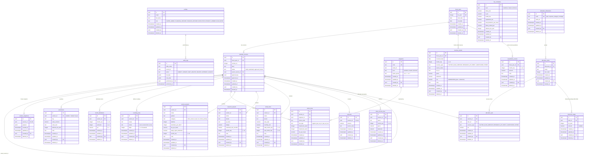

# Entity-Relationship Diagram (ERD) — ระบบประมาณการรายรับเงินรายได้

โมเดลข้อมูลตามข้อกำหนดหัวข้อ 0.5 สำหรับระบบประมาณการรายรับเงินรายได้ คณะรัฐศาสตร์และรัฐประศาสนศาสตร์ มหาวิทยาลัยเชียงใหม่

```mermaid
erDiagram
    profiles {
        uuid id PK
        text email UK
        text full_name
        text role "SUPER_ADMIN | PLANNING_OFFICER | FINANCE_OFFICER | EXECUTIVE | PROJECT_OWNER | EVALUATOR"
        timestamptz created_at
        timestamptz updated_at
        uuid created_by
        timestamptz deleted_at
    }

    audit_logs {
        uuid id PK
        text table_name
        uuid record_id
        text action "INSERT | UPDATE | SOFT_DELETE | DELETE | APPROVE | UNLOCK"
        jsonb old_data
        jsonb new_data
        uuid performed_by FK
        timestamptz performed_at
    }

    fiscal_years {
        uuid id PK
        integer be_year UK
        date start_date
        date end_date
        timestamptz created_at
        timestamptz updated_at
        uuid created_by FK
        timestamptz deleted_at
    }

    estimate_versions {
        uuid id PK
        uuid fiscal_year_id FK
        integer version_no
        text label
        text status "draft | submitted | approved | locked"
        uuid parent_version_id FK
        uuid approved_by FK
        timestamptz approved_at
        timestamptz created_at
        timestamptz updated_at
        uuid created_by FK
        timestamptz deleted_at
    }

    version_snapshots {
        uuid id PK
        uuid version_id FK, UK
        jsonb payload
        timestamptz created_at
        timestamptz updated_at
        uuid created_by FK
        timestamptz deleted_at
    }

    parameters {
        uuid id PK
        uuid version_id FK "nullable = default of year"
        text key
        numeric value_numeric
        text value_text
        integer effective_be_year
        text note
        timestamptz created_at
        timestamptz updated_at
        uuid created_by FK
        timestamptz deleted_at
    }

    month_distribution {
        uuid id PK
        uuid version_id FK
        integer month_seq "1..12"
        integer semester "1 | 2"
        numeric pct "0..1"
        timestamptz created_at
        timestamptz updated_at
        uuid created_by FK
        timestamptz deleted_at
    }

    rounding_rules {
        uuid id PK
        uuid version_id FK
        text scope
        text mode "trunc | round | floor | none"
        integer digits "-3 = thousands"
        timestamptz created_at
        timestamptz updated_at
        uuid created_by FK
        timestamptz deleted_at
    }

    programs {
        uuid id PK
        text code UK
        text name_th
        text level "bachelor | master | doctoral"
        text report_group "1.1.1 .. 1.1.7"
        timestamptz created_at
        timestamptz updated_at
        uuid created_by FK
        timestamptz deleted_at
    }

    fee_schedules {
        uuid id PK
        text level "bachelor | master | doctoral"
        numeric library_fee
        numeric it_fee
        numeric health_fee
        numeric registration_fee
        numeric total_deduction_per_head
        numeric library_refund_pct
        integer effective_be_year
        timestamptz created_at
        timestamptz updated_at
        uuid created_by FK
        timestamptz deleted_at
    }

    tuition_lines {
        uuid id PK
        uuid version_id FK
        uuid program_id FK
        text cohort_code
        text line_type "regular | gen_ed_in | gen_ed_out"
        integer headcount_sem2
        integer headcount_sem1
        numeric fee_per_head
        timestamptz created_at
        timestamptz updated_at
        uuid created_by FK
        timestamptz deleted_at
    }

    service_projects {
        uuid id PK
        uuid version_id FK
        text name
        text partner
        text category "short_course | usac | le | school_activity"
        integer batches
        integer attendees_per_batch
        numeric fee_per_head
        boolean apply_mgmt_deduction
        integer month_seq "1..12"
        text note
        timestamptz created_at
        timestamptz updated_at
        uuid created_by FK
        timestamptz deleted_at
    }

    research_projects {
        uuid id PK
        uuid version_id FK
        text name
        text funder
        text pi_name
        numeric budget
        numeric overhead_rate_override
        integer month_seq "1..12"
        text note
        timestamptz created_at
        timestamptz updated_at
        uuid created_by FK
        timestamptz deleted_at
    }

    rental_items {
        uuid id PK
        uuid version_id FK
        text name
        text tenant
        numeric area_sqm
        numeric monthly_rent
        integer start_month_seq "1..12"
        integer end_month_seq "1..12"
        text note
        timestamptz created_at
        timestamptz updated_at
        uuid created_by FK
        timestamptz deleted_at
    }

    carryover {
        uuid id PK
        uuid version_id FK, UK
        numeric amount
        text source_note
        timestamptz created_at
        timestamptz updated_at
        uuid created_by FK
        timestamptz deleted_at
    }

    other_income_lines {
        uuid id PK
        uuid version_id FK
        text name
        integer month_seq "1..12"
        numeric gross
        numeric deduction
        timestamptz created_at
        timestamptz updated_at
        uuid created_by FK
        timestamptz deleted_at
    }

    revenue_actuals {
        uuid id PK
        uuid fiscal_year_id FK
        date received_date
        integer month_seq "1..12"
        text revenue_type "TUITION | ACAD_SERVICE | RESEARCH_OH | RENT | CARRYOVER | OTHER"
        text source_name
        text ref_no
        numeric gross
        numeric deduction
        numeric net "GENERATED (gross - deduction)"
        text note
        timestamptz created_at
        timestamptz updated_at
        uuid created_by FK
        timestamptz deleted_at
    }

    expenditure_actuals {
        uuid id PK
        uuid fiscal_year_id FK
        integer month_seq "1..12"
        numeric amount
        text note
        timestamptz created_at
        timestamptz updated_at
        uuid created_by FK
        timestamptz deleted_at
    }

    allocation_dimensions {
        uuid id PK
        text code UK "plan | expense_category | strategic"
        text name_th
        timestamptz created_at
        timestamptz updated_at
        uuid created_by FK
        timestamptz deleted_at
    }

    allocation_items {
        uuid id PK
        uuid dimension_id FK
        text name
        integer sort_order
        timestamptz created_at
        timestamptz updated_at
        uuid created_by FK
        timestamptz deleted_at
    }

    allocation_pcts {
        uuid id PK
        uuid version_id FK
        uuid item_id FK
        text revenue_type "TUITION | ACAD_SERVICE | RESEARCH_OH | RENT | CARRYOVER | OTHER"
        numeric pct "0..1"
        timestamptz created_at
        timestamptz updated_at
        uuid created_by FK
        timestamptz deleted_at
    }

    historical_usage {
        uuid id PK
        uuid item_id FK
        integer be_year
        numeric amount "nullable"
        timestamptz created_at
        timestamptz updated_at
        uuid created_by FK
        timestamptz deleted_at
    }

    fiscal_years ||--o{ estimate_versions : "has versions"
    fiscal_years ||--o{ revenue_actuals : "tracks actual revenue"
    fiscal_years ||--o{ expenditure_actuals : "tracks actual expenditure"
    estimate_versions ||--o| estimate_versions : "parent_version_id"
    estimate_versions ||--o| version_snapshots : "frozen snapshot"
    estimate_versions ||--o{ parameters : "overrides"
    estimate_versions ||--o{ month_distribution : "distributes tuition"
    estimate_versions ||--o{ rounding_rules : "defines rounding"
    estimate_versions ||--o{ tuition_lines : "contains"
    estimate_versions ||--o{ service_projects : "contains"
    estimate_versions ||--o{ research_projects : "contains"
    estimate_versions ||--o{ rental_items : "contains"
    estimate_versions ||--o| carryover : "contains"
    estimate_versions ||--o{ other_income_lines : "contains"
    estimate_versions ||--o{ allocation_pcts : "allocates net revenue"
    programs ||--o{ tuition_lines : "classified by"
    allocation_dimensions ||--o{ allocation_items : "groups"
    allocation_items ||--o{ allocation_pcts : "receives share"
    allocation_items ||--o{ historical_usage : "historical spending 2565-2569"
    profiles ||--o{ audit_logs : "performed_by"
```
